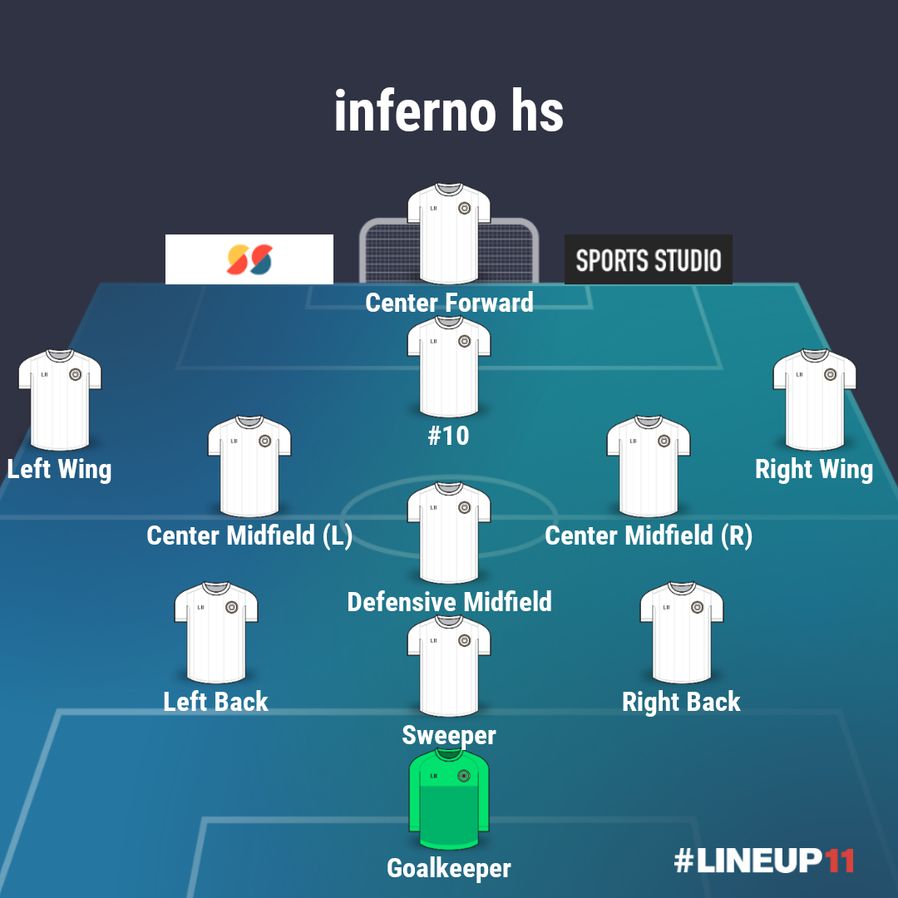

# Inferno Football-Guide
A study guide for MYSA Inferno U14 through Senior sides

## Formation, Shape, and Positional Responsibilites

### Formations and Shape

**3-3-3-1**

### Position Groups

#### Position Group: Attackers

##### Center Forward

**Defensive and Pressing Responsibilities**

* Stay high and central when the ball is in our defensive 3rd.  
* In our attacking 3rd, when the opposition central defense has the ball, close down quickly and keep the player in front.  If the ball is played wide, back off and encourage a ball back into the middle.  Anticipate and close.

#### Position Group: Midfielders

#### Position Group: Defenders

#### Position Group: Goalkeepers
