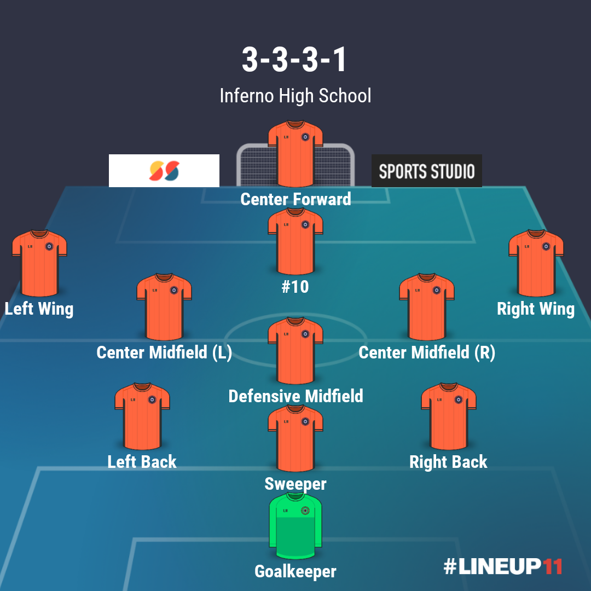

# Inferno Football-Guide
A study guide for MYSA Inferno U14 through Senior sides

[_return to front page_](./../README.md)

## Formation, Shape, and Positional Responsibilites

### Formations and Shape

### Position Groups

#### Position Group: Attackers

**Center Forward**

* Defensive and Pressing Responsibilities
  * Defensive 3rd
   * Stay high and central when the ball is in our defensive 3rd.  
  * Attacking 3rd
   * In our attacking 3rd, when the opposition central defense has the ball, close down quickly and keep the player in front.  If the ball is played wide, back off and encourage a ball back into the middle.  Anticipate and close.

**Attacking Midfielder/#10/Enganche**

* Defensive and Pressing Responsibilities
  * Defensive 3rd
    * Look for gaps in the 2nd level of our defensive shape and fill in when needed.
    * Anticipate a turnover and get in an area where you can be an outlet to launch a quick attack.
  * Middle 3rd
    * When the opposition has possession in the middle third, look for opportunities to pick-pocket the ball in the middle (coming from behind when the opposition is not aware you are there) 
   * Anticipate a turnover and get in an area where you can be an outlet to launch a quick attack.
* Attacking Movement and responsibility

**Winger**

* Defensive and Pressing Responsibilities
  * Defensive 3rd
    * Look for gaps and weak areas in the 3 Lane defense.  Slide into the midfield when necessary, especially on the weak side of the 3 Lane defense.  This allows for the central midfielders to be compact and eliminate gaps.  This also allows for defensive players to challenge and close down the ball.
    * The ball-side wing should try to stay higher up (3rd level) and be an outlet if we win the ball.
  * Middle 3rd
    * Ball-side tracking and harassment of the ball - if the midfield is slow to slide over to the ball side flank, the ball-side winger must track the ball all the way to the defensive line (1st level).
    * Winning the ball is not the primary objective here.
    * Delay, tracking and preventing crosses and shots is the priority.
  * Attacking 3rd
    * Intermediate and direct pressure on opposition back line, specifically fullbacks and wingbacks or wide centre backs.
    * Harass and be aggressive, but it isn't necessary to win the ball.
    * Funnel play to the inside
    * Prevent opposition defenders from playing long balls forward
    * If the ball is inside the opposition's 18 yard box, try to win the ball
    * Be physical.  This is the area of the field where we will accept a foul.  

#### Position Group: Midfielders

#### Position Group: Defenders

#### Position Group: Goalkeepers
