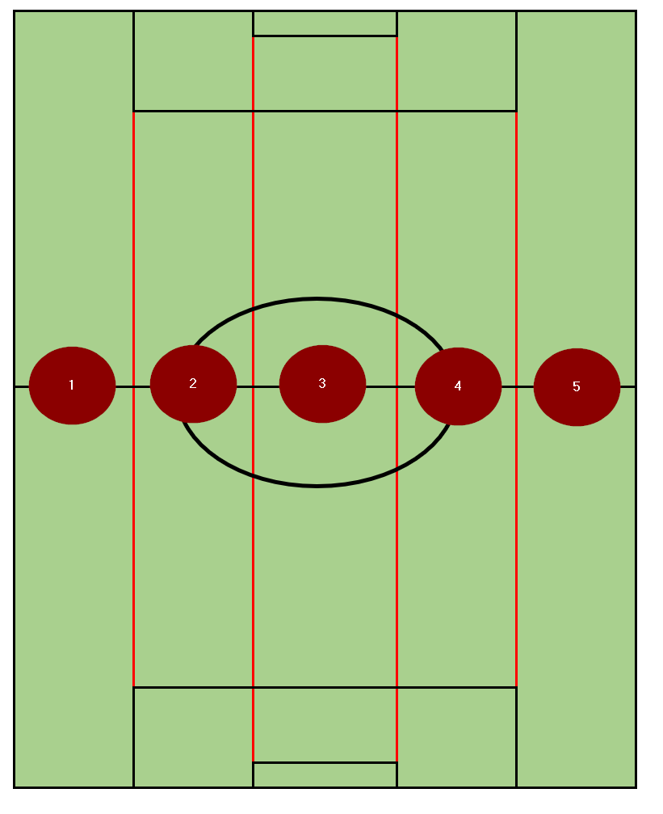
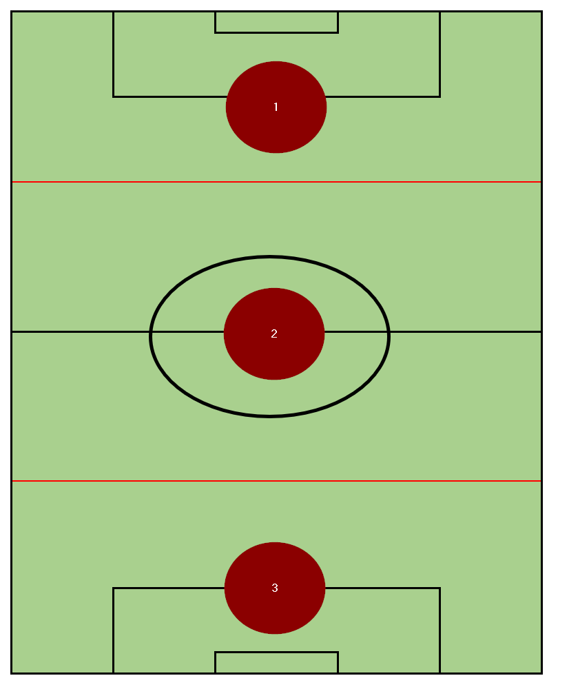

# Inferno Football-Guide
A study guide for MYSA Inferno U14+ sides

[_return to front page_](./../README.md)

## Breaking up the field (Regions)

### Breaking up the field: Five Vertical Lanes

Assuming the ball is closest to the left sideline:

1. Ball-side Flank
2. Ball-side Channel
3. Center (the difference between middle is to avoid confusion between the center lane and the middle 3rd)
4. Weak-side Channel
5. Weak-side Flank

### Breaking up the field: Three Horizontal Lanes

1. Attacking Third
2. Middle Third
3. Defending Third
