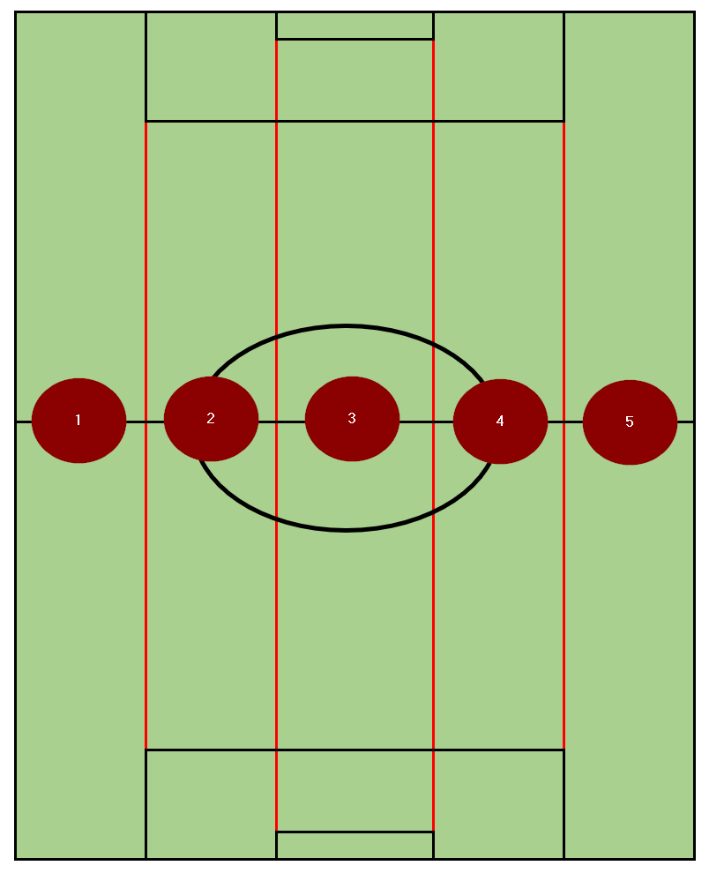
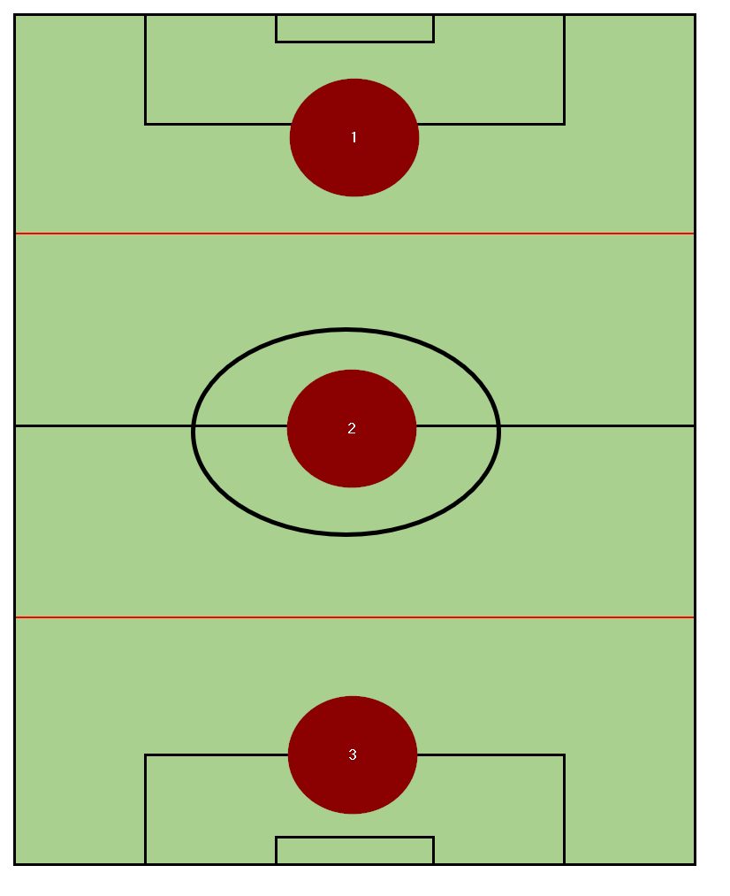

# Inferno Football-Guide
A study guide for MYSA Inferno U14+ sides

## Phases of Play

**Attack**

When we have possession of the ball

**Attacking Transition**

This occurs immediately after we win the ball from the opposition.  This is our best opportunity to score.
 
**Defense** 

When opposition has possession of the ball

**Defensive Transition**

This occurs immediately after we lose the ball.  This is the phase of play where we are most vulnerable to the other team scoring.  We need to be super aware of when possession is lost and take steps to get in a responsible defensive shape and get in front of the ball.  This is the only phase of play where winning the ball is preferrable to playing passively and keeping the player in front.  One player should be trying to win the ball and supporting players need to be in position if that player gets beat.

**Dead Ball**

Any restart after a whistle (re-starting play); either in attack or defense.

## Breaking up the field (Regions)

### Breaking up the field: Five Vertical Lanes

Assuming the ball is closest to the left sideline:

1. Ball-side Flank
2. Ball-side Channel
3. Center (the difference between middle is to avoid confusion between the center lane and the middle 3rd)
4. Weak-side Channel
5. Weak-side Flank

### Breaking up the field: Three Horizontal Lanes

1. Attacking Third
2. Middle Third
3. Defending Third

## Philosophy

### Philosophy: Attacking

### Philosophy: Defending

## Principles of Play

### Principles of Play: Attack

### Principles of Play: Defense

## Formation, Shape, and Positional Responsibilites

### Formations and Shape

### Position Groups

#### Position Group: Attackers

#### Position Group: Midfielders

#### Position Group: Defenders

#### Position Group: Goalkeepers

## Set Pieces

### Attacking Set Pieces

#### Attacking Throw Ins

#### Attacking Goal Kicks

#### Attacking Corner Kicks

#### Attacking Direct Free Kicks

#### Attacking Indirect Free Kicks

#### Attacking Kick Offs

### Defending Set Pieces

#### Defending Throw Ins

#### Defending Goal Kicks

#### Defending Corner Kicks

#### Defending Direct Free Kicks

#### Defending Indirect Free Kicks

#### Defending Kick Offs
